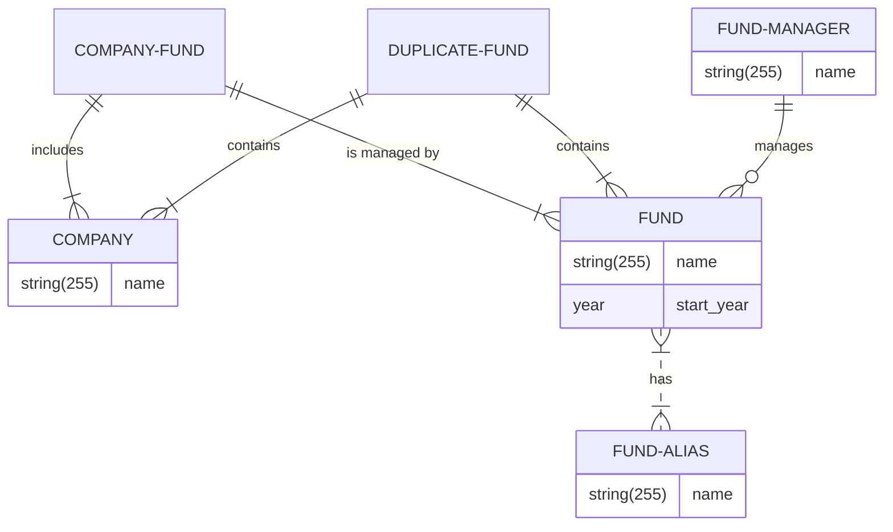

# Funds

Canoe’s business is centered around various applications that automate workflows for the administration of investment funds.

To do this efficiently, we need a master database that can be shared by these applications as a single source of truth for these investment funds.

This dataset is constantly changing and requires some amount of manual curation by a data quality team using a web application that is built for the purpose of maintaining this data.

This exercise requires building a data model and back-end service to support a couple of the basic use cases for this web application.

Fund Records can be created, read, updated, and deleted manually in this application.

There also will be back-end processes that are creating new records automatically.

Some of the automatically created records will be duplicates that will need to be manually reconciled.


## ER Diagram



## Setup

Clone the repository: `git clone git@github.com:leopoletto/funds.git leopoletto`

Install dependencies: `composer install & npm install`

Clone and rename the `.env.example` file to `.env` and run: `./vendor/bin/sail artisan key:generate`

Create the Docker container using Laravel Sail: `./vendor/bin/sail up`

Run the migration: `./vendor/bin/sail artisan migrate`

## Running the API

Import the `Insomnia.json` file to Insomnia app which contains all the endpoints in the correct order.

###  Register user

```CURL
curl --request POST \
  --url http://localhost/api/users \
  --header 'Accept: application/json' \
  --header 'Content-Type: application/json' \
  --header 'User-Agent: insomnia/2023.5.8' \
  --data '{
	"email": "acme@example.com",
	"password": "password"
}'
```
### Login user

Use the e-mail and password (It automatically fills the token value for the next requests)

```CURL
curl --request POST \
  --url http://localhost/api/login \
  --header 'Accept: application/json' \
  --header 'Content-Type: application/json' \
  --header 'User-Agent: insomnia/2023.5.8' \
  --data '{
	"email": "acme@example.com",
	"password": "password"
}'
```

###  Seeding the database

There are two ways of seeding the database:

#### Via Command

Seed the database: `./vendor/bin/sail artisan db:seed`

#### Via API

You can specify the number of funds you wish to be created, and how many of them with duplicate funds.
```CURL
curl --request POST \
  --url http://localhost/api/funds/seed \
  --header 'Accept: application/json' \
  --header 'Authorization: Bearer 22|hseYuRfyoFgYNO6lSYKIGNqL5EHykeJHPSJNQAlqe7e08c91' \
  --header 'Content-Type: application/json' \
  --header 'User-Agent: insomnia/2023.5.8' \
  --data '{
	"amount": 5,
	"duplicate": 5
}'
```

### Create Fund

```CURL
curl --request POST \
  --url 'http://localhost/api/funds?=' \
  --header 'Accept: application/json' \
  --header 'Authorization: Bearer 22|hseYuRfyoFgYNO6lSYKIGNqL5EHykeJHPSJNQAlqe7e08c91' \
  --header 'Content-Type: application/json' \
  --header 'User-Agent: insomnia/2023.5.8' \
  --data '{
	"name": "ACME Global Fund",
	"start_year": "2023",
	"aliases": ["ACME Fund", "ACME Global"],
	"companies": [1,2],
	"fund_manager_id": 1
}'
```

### Read Fund

```CURL
curl --request GET \
  --url http://localhost/api/funds/1 \
  --header 'Accept: application/json' \
  --header 'Authorization: Bearer 22|hseYuRfyoFgYNO6lSYKIGNqL5EHykeJHPSJNQAlqe7e08c91' \
  --header 'Content-Type: application/json' \
  --header 'User-Agent: insomnia/2023.5.8'
```
### Update Fund

```CURL
curl --request PUT \
  --url http://localhost/api/funds/12 \
  --header 'Accept: application/json' \
  --header 'Authorization: Bearer 22|hseYuRfyoFgYNO6lSYKIGNqL5EHykeJHPSJNQAlqe7e08c91' \
  --header 'Content-Type: application/json' \
  --header 'User-Agent: insomnia/2023.5.8' \
  --data '{
	"name": "ACME Global Fund",
	"start_year": "2023",
	"aliases": ["ACME Fund", "ACME Global"],
	"companies": [1,2],
	"fund_manager_id": 1
}'
```

### Delete fund

```CURL
curl --request DELETE \
  --url http://localhost/api/funds/12 \
  --header 'Accept: application/json' \
  --header 'Authorization: Bearer 22|hseYuRfyoFgYNO6lSYKIGNqL5EHykeJHPSJNQAlqe7e08c91' \
  --header 'Content-Type: application/json' \
  --header 'User-Agent: insomnia/2023.5.8'
```

### List funds

You can filter by:
- `name`: it considers similar existing fund and alias names
- `start_year`
- `fund_manager_id`

```CURL
curl --request GET \
  --url 'http://localhost/api/funds?name=ACME&start_year=2023&fund_manager_id=1' \
  --header 'Accept: application/json' \
  --header 'Authorization: Bearer 22|hseYuRfyoFgYNO6lSYKIGNqL5EHykeJHPSJNQAlqe7e08c91' \
  --header 'Content-Type: application/json' \
  --header 'User-Agent: insomnia/2023.5.8'
```

#### Response Example:

```JSON
{
    "data":[
        {
            "id":40,
            "name":"Smitham PLC",
            "start_year":"2020",
            "aliases":[
                {
                    "id":41,
                    "name":"Herman-Bernhard",
                    "created_at":"2023-09-22T03:33:02.000000Z",
                    "updated_at":"2023-09-22T03:33:02.000000Z"
                }
            ],
            "companies":[
                {
                    "id":62,
                    "name":"Reina Labadie",
                    "created_at":"2023-09-22T03:33:02.000000Z",
                    "updated_at":"2023-09-22T03:33:02.000000Z"
                }
            ],
            "fund_manager":{
                "id":15,
                "name":"Dr. Alfonzo Sporer PhD",
                "created_at":"2023-09-22T03:33:02.000000Z",
                "updated_at":"2023-09-22T03:33:02.000000Z"
            },
            "duplicate_funds":[
                {
                    "id":45,
                    "name":"Smitham PLC",
                    "start_year":"2020",
                    "created_at":"2023-09-22T03:33:02.000000Z",
                    "updated_at":"2023-09-22T03:33:02.000000Z"
                },
                {
                    "id":46,
                    "name":"Smitham PLC",
                    "start_year":"2020",
                    "created_at":"2023-09-22T03:33:02.000000Z",
                    "updated_at":"2023-09-22T03:33:02.000000Z"
                }
            ],
            "created_at":"2023-09-22T03:33:02.000000Z",
            "updated_at":"2023-09-22T03:33:02.000000Z"
        }
    ]
}
```

### Reconcile Funds

As the previous response shows, we have a fund of id 40 that contains duplicate funds of id 45 and 46.

Here is an example of how to reconcile the 45 and 46 into 40

```CURL
curl --request POST \
  --url http://localhost/api/funds/40/reconcile \
  --header 'Accept: application/json' \
  --header 'Authorization: Bearer 22|hseYuRfyoFgYNO6lSYKIGNqL5EHykeJHPSJNQAlqe7e08c91' \
  --header 'Content-Type: application/json' \
  --header 'User-Agent: insomnia/2023.5.8' \
  --data '{
	"funds": [45,46]
}'
```
Now all the companies (merge) and aliases of 45 and 46 will belong to 40. The duplicate records will be deleted. 


## Testing

Run: `sail artisan test`

### Example

```

    PASS  Tests\Feature\AuthenticationTest
    ✓ user get an api token when credentials match                                                                                        1.12s
    ✓ user authentication fails when credentials dont match                                                                               0.02s
    
    PASS  Tests\Feature\DuplicateFundRegistrationTest
    ✓ duplicate fund registration when a warning event is dispatched                                                                      0.02s
    
    PASS  Tests\Feature\FundCreationTest
    ✓ fund can be created                                                                                                                 0.03s
    ✓ duplicate fund creation dispatch an event                                                                                           0.02s
    
    PASS  Tests\Feature\FundDeletionTest
    ✓ fun can be deleted                                                                                                                  0.02s
    
    PASS  Tests\Feature\FundReconciliationTest
    ✓ duplicate funds can be reconciled                                                                                                   0.03s
    
    PASS  Tests\Feature\FundSearchTest
    ✓ funds can be listed                                                                                                                 0.15s
    ✓ funds can be searched by name                                                                                                       0.04s
    ✓ funds can be searched by start year                                                                                                 0.03s
    ✓ funds can be searched by fund manager id                                                                                            0.02s
    
    PASS  Tests\Feature\FundSeedingTest
    ✓ funds can be seeded                                                                                                                 0.06s
    ✓ funds can be seeded with some duplicate                                                                                             0.11s
    
    PASS  Tests\Feature\FundUpdateTest
    ✓ fund can be updated                                                                                                                 0.02s
    
    PASS  Tests\Feature\UserRegistrationTest
    ✓ user can be registered                                                                                                              0.03s
    
    Tests:    15 passed (45 assertions)
    Duration: 1.91s
```

## Trade-offs

I chose not to create services and repositories at this point given the expected time to complete.

The reconcile method is just a hypothesis of how it could work.

The event is being handled by an internal listener that registers the potential duplicate fund in a specific table. 
But it could also be published in a message-broker.

The seed method uses factories to simulate the process. 
I assume the real data would come from a parsed document or spreadsheet. 

The error handling is Laravel default, but thinking about a larger application we could add custom exceptions and create specific codes mapping the errors. 
